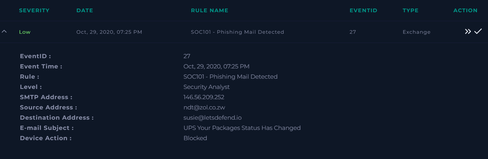
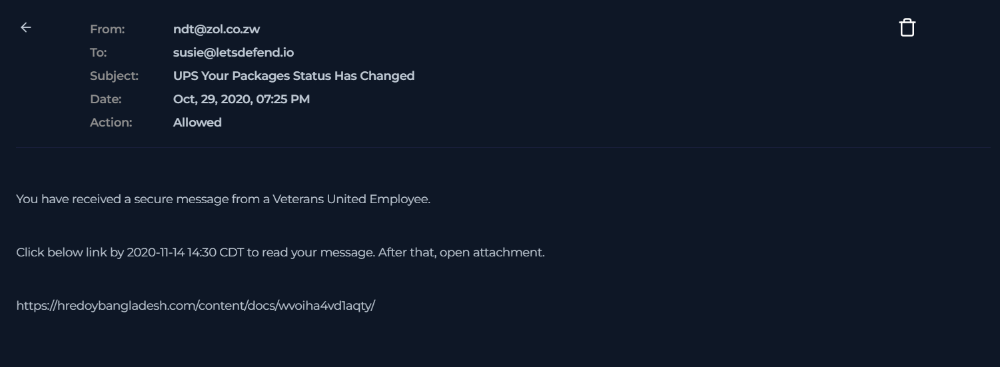
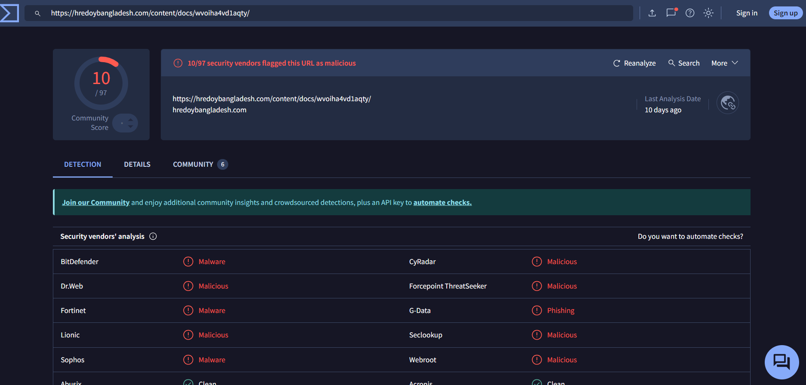

# SOC Investigation Report: Phishing Mail Detected (Event ID: 27)

## 1. Alert Overview
- **Event ID:** 27
- **Event Time:** Oct 29, 2020, 07:25 PM
- **Rule Name:** SOC101 - Phishing Mail Detected
- **SMTP Address:** 146.56.209.252
- **Source Address:** ndt@zol.co.zw
- **Destination Address:** susie@letsdefend.io

> 

---

## 2. Investigation Steps

### Email Analysis
I accessed the **Email Security** section and searched for the SMTP address `146.56.209.252` to identify the specific email associated with the alert.

- **Findings:** The email was successfully located in the search results.

> 

### URL Reputation Check
Upon inspecting the email, a link was identified within the body of the message. I extracted the URL and analyzed it using **VirusTotal**.

- **Results:** The link was explicitly marked as malicious by the security engines on VirusTotal.

> 

---

## 3. Analysis Questions (Playbook)
- **Is the email content suspicious?** Yes.
- **Does it contain any attachments or URLs?** Yes.
- **Was the mail delivered to the user?** Yes.
- **Did someone open the URL?** No.

---

## 4. Actions Taken & Remediation
Following the confirmation that the email was malicious but had not been interacted with by the user, the following action was taken:
1. **Email Deletion:** The malicious email was deleted from the recipient's mailbox to prevent any future interaction.

---

## 5. Final Conclusion
**Verdict:** True Positive
**Reasoning:** The investigation confirmed that the email originated from a suspicious source and contained a malicious link. Although the mail was delivered, no evidence of user interaction was found. The threat was mitigated by deleting the email.
