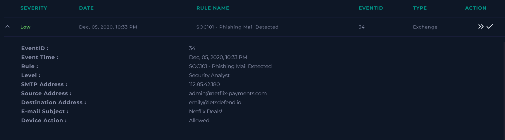
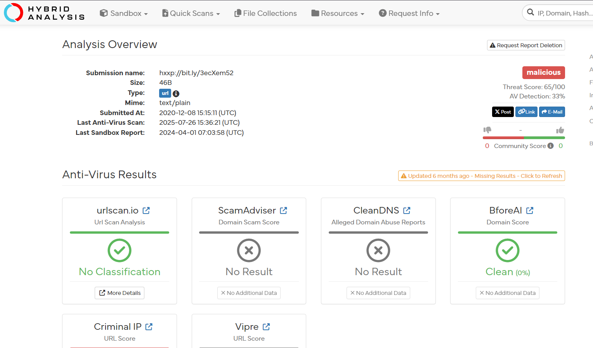
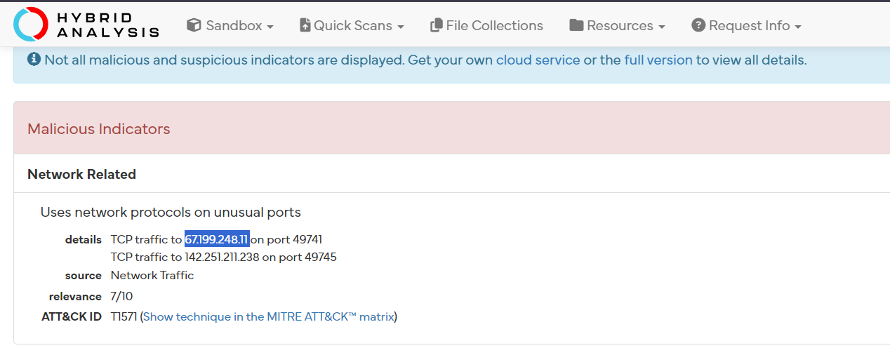
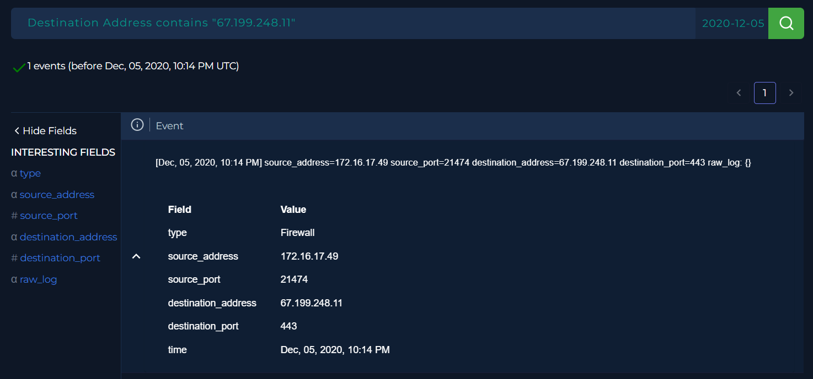

# SOC Investigation Report: Phishing Mail Detected (Event ID: 34)

## 1. Alert Overview
- **Event ID:** 34
- **Event Time:** Dec 05, 2020, 10:33 PM
- **Rule Name:** SOC101 - Phishing Mail Detected
- **SMTP Address:** 112.85.42.180
- **Source Address:** admin@netflix-payments.com
- **Destination Address:** emily@letsdefend.io

> 

---

## 2. Investigation Steps

### Email Analysis
I navigated to the **Email Security** tab and searched for the SMTP address `112.85.42.180`. Through this search, the actual email sent to the user was identified.

- **Findings:** The email contained a URL link.

> 

### Malicious URL Analysis
I extracted the link from the email and analyzed it using **VirusTotal** and **Hybrid Analysis**.
- **Results:** The URL was marked as malicious.
- **Indicators:** Hybrid Analysis identified a specific malicious IP address associated with the URL: `67.199.248.11`.

> 
> 

### Log Correlation
I checked the **Log Management** system to see if there was any traffic between the internal network and the malicious IP (`67.199.248.11`).

- **Findings:** A connection was found originating from the internal IP address `172.16.17.49`.
- **Conclusion:** This confirms that the user opened the malicious link.

> 

---

## 3. Analysis Questions (Playbook)
- **Is the email content suspicious?** Yes.
- **Does it contain any attachments or URLs?** Yes.
- **Was the mail delivered to the user?** Yes.
- **Did someone open the URL?** Yes.

---

## 4. Actions Taken & Remediation
Following the discovery of an active connection to a malicious site, the following actions were performed:
1. **Email Deletion:** The malicious email was deleted from the system.
2. **Device Containment:** The infected device (IP: `172.16.17.49`) was contained to prevent further damage.

---

## 5. Final Conclusion
**Verdict:** True Positive
**Reasoning:** The investigation confirmed a malicious email was delivered and that the recipient interacted with the link, leading to a connection with a malicious IP. The device was successfully isolated.
