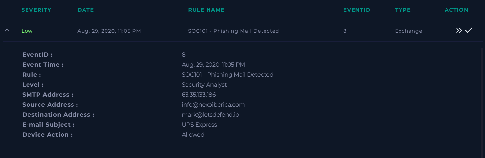
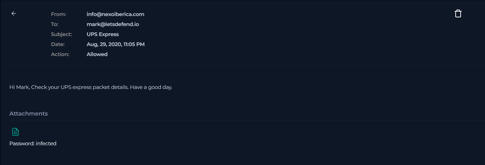
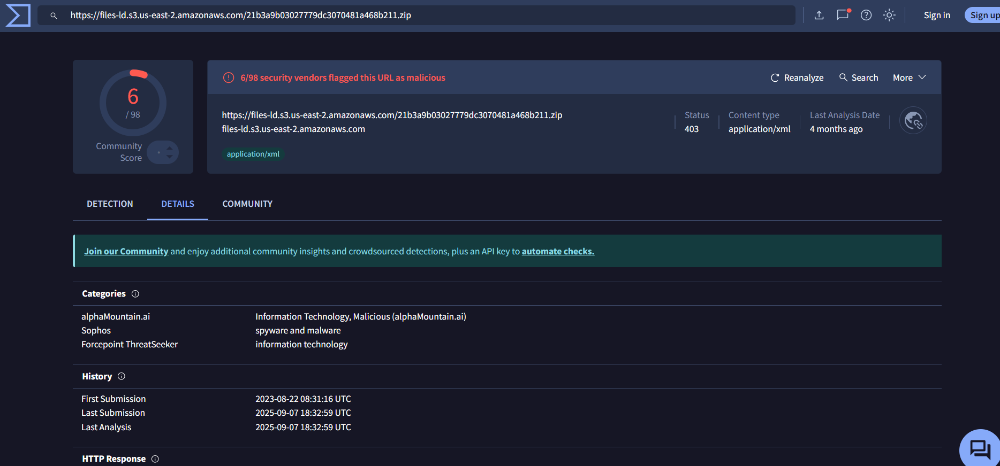
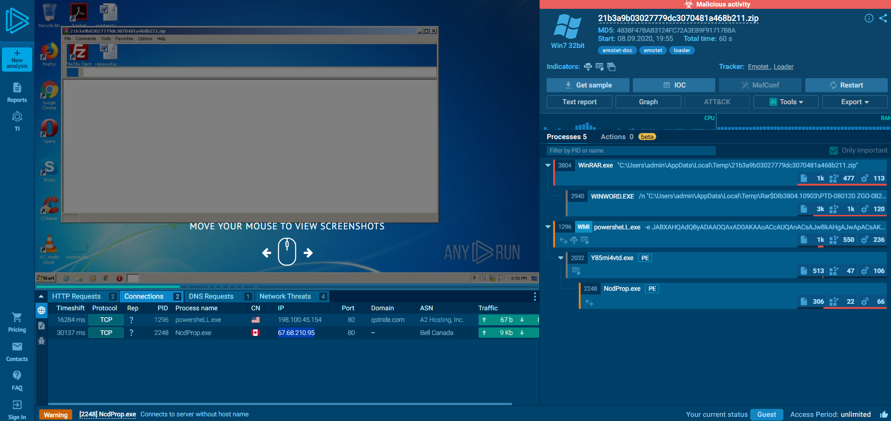
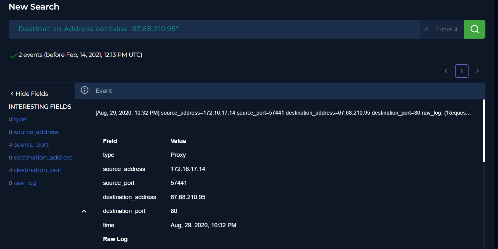

# SOC Investigation Report: Phishing Mail Detected (Event ID: 8)

## 1. Alert Overview
- **Event ID:** 8
- **Event Time:** Aug 29, 2020, 11:05 PM
- **Rule Name:** SOC101 - Phishing Mail Detected
- **SMTP Address:** 63.35.133.186
- **Source Address:** info@nexoiberica.com
- **Destination Address:** mark@letsdefend.io

> 

---

## 2. Investigation Steps

### Email Analysis
I proceeded to the **Email Security** section and performed a search using the SMTP address `63.35.133.186`. This search led to the identification of the actual email.

- **Findings:** The email was found to contain a file.

> 

### Malware & Payload Analysis
I analyzed the link/file using **VirusTotal** and **AnyRun** to determine if it was malicious.
- **VirusTotal Result:** The link was marked as malicious.
- **AnyRun Analysis:** Checking the malicious indicators on AnyRun revealed two specific malicious IP addresses:
  - `67.68.210.95`
  - `198.100.45.154`

> 
> 

### Log Correlation
I conducted a search in the **Log Management** system to check for any traffic related to the malicious indicators found during the analysis.

- **Findings:** A connection was identified to the malicious IP address from the address `67.68.210.95`.
- **Conclusion:** This evidence confirms that the file was opened and the connection was established.

> 

---

## 3. Analysis Questions (Playbook)
- **Is the email content suspicious?** Yes.
- **Does it contain any attachments or URLs?** Yes.
- **Was the mail delivered to the user?** Yes.
- **Did someone open the file?** Yes.

---

## 4. Actions Taken & Remediation
Based on the confirmation of a device infection, the following incident response actions were performed:
1. **Email Deletion:** The malicious email was deleted from the system.
2. **Device Containment:** The infected device was contained to prevent further malicious activity.

---

## 5. Final Conclusion
**Verdict:** True Positive
**Reasoning:** The investigation confirmed the delivery of a malicious email containing a file. Analysis through VirusTotal and AnyRun confirmed the payload was malicious, and log analysis proved that a user opened the file, resulting in an infected device.
